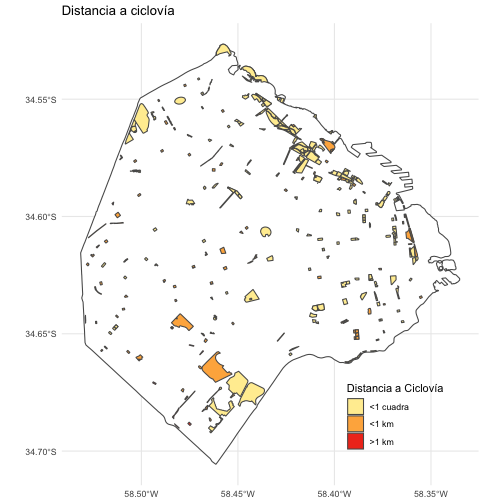

```r
require(sf)
```

```
## Loading required package: sf
```

```
## Warning: package 'sf' was built under R version 4.1.2
```

```
## Linking to GEOS 3.9.1, GDAL 3.4.0, PROJ 8.1.1; sf_use_s2() is TRUE
```

```r
require(tidyverse)
```

```
## Loading required package: tidyverse
```

```
## ── Attaching packages ───────────────────────────────────────────────── tidyverse 1.3.1 ──
```

```
## ✓ ggplot2 3.3.5     ✓ purrr   0.3.4
## ✓ tibble  3.1.6     ✓ dplyr   1.0.8
## ✓ tidyr   1.2.0     ✓ stringr 1.4.0
## ✓ readr   2.1.2     ✓ forcats 0.5.1
```

```
## Warning: package 'tidyr' was built under R version 4.1.2
```

```
## Warning: package 'readr' was built under R version 4.1.2
```

```
## Warning: package 'dplyr' was built under R version 4.1.2
```

```
## ── Conflicts ──────────────────────────────────────────────────── tidyverse_conflicts() ──
## x dplyr::filter() masks stats::filter()
## x dplyr::lag()    masks stats::lag()
```

```r
require(ggplot2)
require(patchwork)
```

```
## Loading required package: patchwork
```

```r
require(ggmap)
```

```
## Loading required package: ggmap
```

```
## Google's Terms of Service: https://cloud.google.com/maps-platform/terms/.
```

```
## Please cite ggmap if you use it! See citation("ggmap") for details.
```

```r
require(osmdata)
```

```
## Loading required package: osmdata
```

```
## Warning: package 'osmdata' was built under R version 4.1.2
```

```
## Data (c) OpenStreetMap contributors, ODbL 1.0. https://www.openstreetmap.org/copyright
```

```r
bb = getbb('Ciudad Autonoma de Buenos Aires, Argentina',format_out = 'polygon')
bbox_ba = getbb("Ciudad Autonoma de Buenos Aires, Argentina")

ciudad = st_polygon(list(bb[[2]][[1]]))
ciudad = st_sfc(ciudad)
st_crs(ciudad) = 4326
parques_full = st_read('parquesCorteArea2_5perc_fullfeatures.geojson')
```

```
## Reading layer `parquesCorteArea2_5perc_fullfeatures' from data source 
##   `/Users/inespatop/Documents/resume/Taller_de_datos_populares_espaciospublicos/Encuentro6/parquesCorteArea2_5perc_fullfeatures.geojson' 
##   using driver `GeoJSON'
## Simple feature collection with 1065 features and 45 fields
## Geometry type: MULTIPOLYGON
## Dimension:     XY
## Bounding box:  xmin: 5634919 ymin: 6160053 xmax: 5651113 ymax: 6179027
## Projected CRS: Campo Inchauspe / Argentina 5
```

```r
parques_full = parques_full %>% st_transform(crs=4326)
# Todos los parques, mostrando ambas áreas
ggplot() + theme_minimal()+ theme(legend.position = c(.8,.1))+
  geom_sf(data=ciudad,fill='white') +
  geom_sf(data=parques_full,mapping=aes(fill=area>=5e3)) +
  scale_fill_discrete(name = "Area mayor a 1/2 ha",labels=c('No','Sí')) +
  ggtitle('Parques')
```


```r
# Todos los parques, areas <0.5ha
ggplot() + theme_minimal()+ theme(legend.position = c(.8,.1))+
  geom_sf(data=ciudad,fill='white') +
  geom_sf(data=parques_full %>% filter(area<5e3)) +
  ggtitle('Parques con area < 1/2ha')
```


```r
# Parques con JPN
ggplot() + theme_minimal()+ theme(legend.position = c(.8,.15))+
  geom_sf(data=ciudad,fill='white') +
  geom_sf(data=parques_full %>% filter(area>=5e3),mapping=aes(fill=JPN)) +
  ggtitle('Parques y Juegos para Niñes')
```


```r
# Parques con fitness_station + canchas
ggplot() + theme_minimal()+ theme(legend.position = c(.8,.15))+
  geom_sf(data=ciudad,fill='white') +
  geom_sf(data=parques_full %>% filter(area>=5e3),mapping=aes(fill=fitness_station+canchas)) +
  scale_fill_continuous(name='Cantidad de espacios')+
  ggtitle('Fitness y canchas')
```


```r
# Parques y ciclovía
ggplot() + theme_minimal() + theme(legend.position = c(.8,.15)) +
  geom_sf(data=ciudad,fill='white') +
  geom_sf(data=parques_full %>% filter(area>=5e3) %>% 
            mutate('DBB'=case_when(distanciaBicisenda<=1e2 ~ '<1 cuadra',
                      distanciaBicisenda<=1e3 ~ '<1 km',
                      distanciaBicisenda>1e3 ~ '>1 km')),mapping=aes(fill=DBB)) +
  scale_fill_brewer(name='Distancia a Ciclovía',palette = "YlOrRd") +
  ggtitle('Distancia a ciclovía')
```



```r
# Paradas de colectivo
ggplot() + theme_minimal() + theme(legend.position = c(.8,.15)) +
  geom_sf(data=ciudad,fill='white') +
  geom_sf(data=parques_full %>% filter(area>=5e3),
          mapping=aes(fill=paradasA200m)) +
  scale_fill_continuous(name='Paradas de colectivo') +
  ggtitle('Paradas a menos de 200m')
```


```r
precenso = new.env()
load('../Precenso_2021/precenso2021_06.RData',envir = precenso)
precenso = as.list(precenso)
precenso = precenso$dataset
precenso = st_as_sf(precenso,coords=c('longitud_centroide','latitud_centroide'))
st_crs(precenso) = 4326

parques = parques_full %>% filter(area>=5e3)
D = st_distance(parques,precenso)

nrow(D)
```

```
## [1] 320
```

```r
nrow(parques)
```

```
## [1] 320
```

```r
parques$potencial_viviendas = sapply(1:nrow(parques),function(i){
  di = D[i,]
  di = as.numeric(di)
  di = ifelse(di<10,10,di)
  -sum(precenso$ind01/di)
})

i = 1

precenso$potencial_parques = sapply(1:nrow(precenso),function(i){
  di = D[,i]
  di = as.numeric(di)
  di[di<10] = 10
  sum(parques$area/1e4/di)
})


# Todos los parques, potencial
ggplot() + theme_minimal()+ theme(legend.position = c(.8,.1))+
  geom_sf(data=ciudad,fill='white') +
  geom_sf(data=parques,mapping=aes(fill=potencial_viviendas)) +
  scale_fill_gradient(low='red',high='yellow')+
  ggtitle('Potencial viviendas')
```


```r
# Parques y radios censales, potencial
ggplot() + theme_minimal()+ theme(legend.position = c(.1,.86))+
  geom_sf(data=ciudad,fill='white') +
  geom_sf(data=precenso,mapping=aes(color=log(potencial_parques)),size=.5) +
  scale_color_gradient(high='red',low='yellow',name='lPoteParques')+
  geom_sf(data=parques,mapping=aes(fill=log(-potencial_viviendas))) +
  scale_fill_gradient(high='red',low='yellow',name='lPoteViviendas')
```


